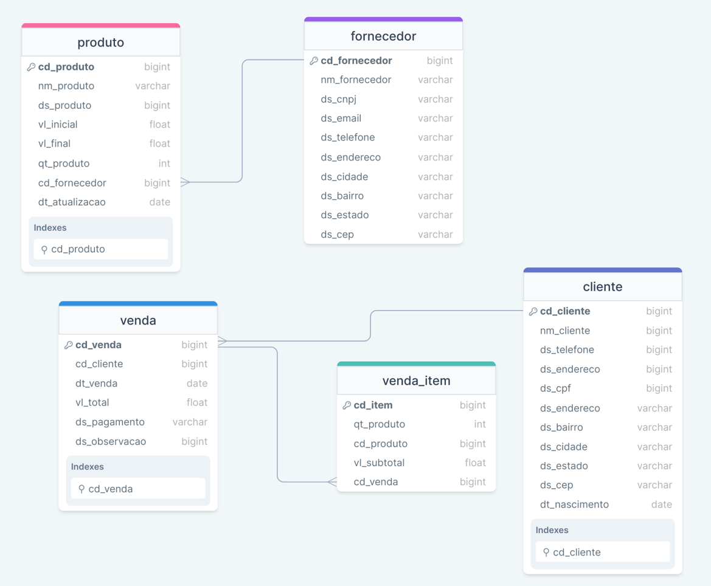
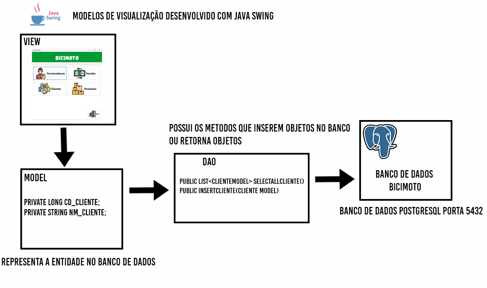
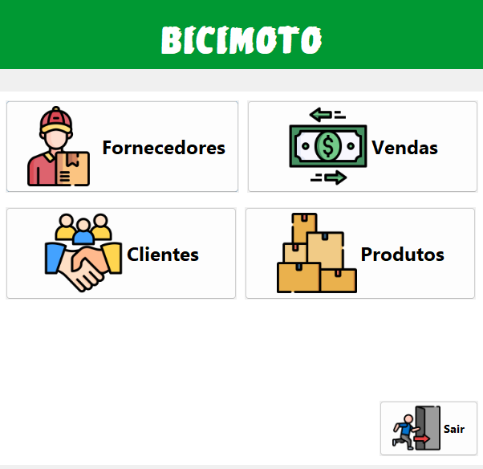
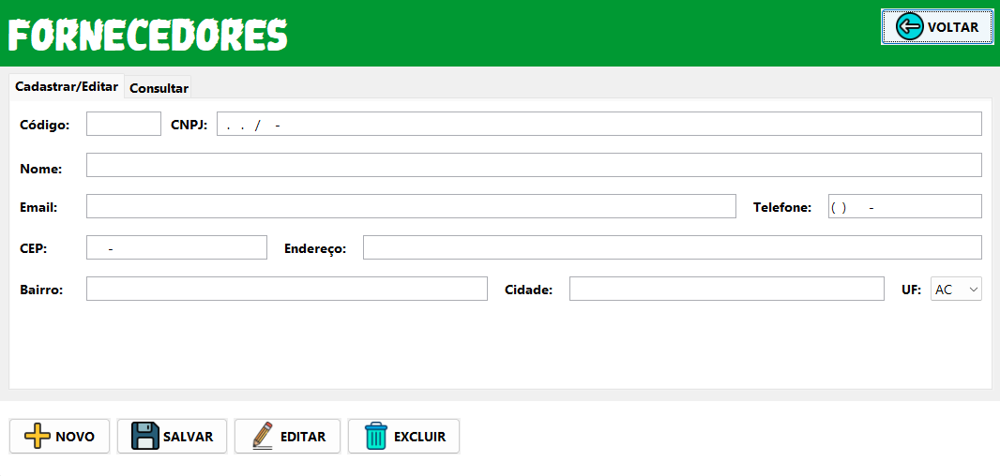
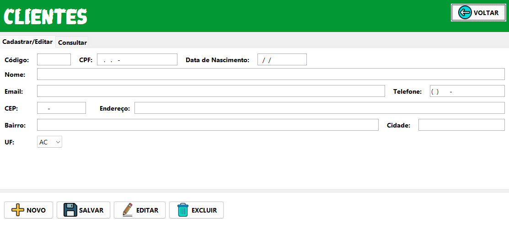
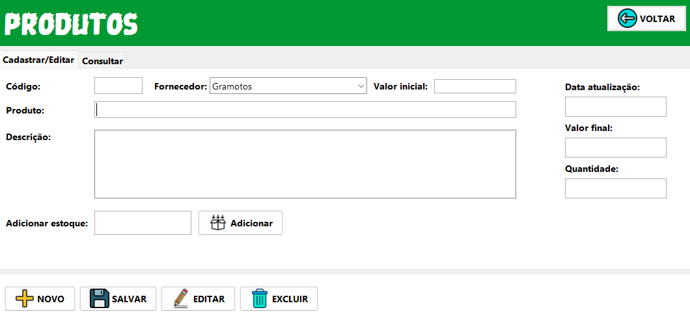
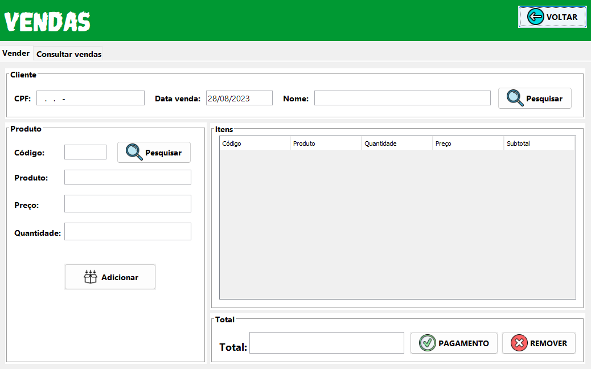

# Sistema Bicimoto

Este projeto foi desenvolvido com dedicação para atender às necessidades específicas de um colega que iniciou recentemente sua pequena empresa. Trata-se de um sistema de gerenciamento completo de controle de estoque e vendas. 

A interface do sistema foi projetada com a tecnologia Java Swing para garantir uma experiência de usuário intuitiva e eficiente em uma aplicação desktop independente de internet. Além disso, o banco de dados PostgreSQL foi escolhido como a base sólida para armazenamento e recuperação de dados.

### Começando

Para executar o projeto você precisa instalar:

[PostgreSQL: Downloads](https://www.postgresql.org/download/)

[Java](https://www.java.com/en/download/)

[Java JDK](https://www.oracle.com/java/technologies/downloads/)

Adiante você deve acessar a pasta `database` e executar o arquivo `init.sql`. Esse arquivo possui a criação de usuário com todos privilégio necessários, além disso, possui o SQL para criação de todas tabelas utilizadas.

Com o banco de dados criado e após instalar  as ferramentas, será possível executar o arquivo .jar do sistema.

```bash
java -jar bicimoto-1.0-SNAPSHOT-jar-with-dependencies.jar
```

## Modelagem:

### Banco de dados



### Arquitetura



### Telas



Menu inicial



Cadastro e consulta de fornecedores



Cadastro e consulta de clientes



Cadastro, consulta e ajuste de estoque



Registro e consulta de vendas

## Dependências

1. **JUnit**:
    - Group ID: junit
    - Artifact ID: junit
    - Version: 4.13.2
    - Escopo (Scope): test
    - Tipo (Type): jar
2. **PostgreSQL JDBC Driver**:
    - Group ID: org.postgresql
    - Artifact ID: postgresql
    - Version: 42.6.0
3. **Apache Commons DBCP**:
    - Group ID: org.apache.commons
    - Artifact ID: commons-dbcp2
    - Version: 2.9.0
4. **Dom4j**:
    - Group ID: org.dom4j
    - Artifact ID: dom4j
    - Version: 2.1.4
5. **Gson**:
    - Group ID: com.google.code.gson
    - Artifact ID: gson
    - Version: 2.10.1
    

### Integração com o ViaCEP

Integrei a API ViaCEP para obter informações detalhadas, incluindo endereço, bairro, cidade e estado, com base em um CEP fornecido. O funcionamento dessa API é bastante simples: envio uma solicitação GET para o seguinte endereço **`viacep.com.br/ws/[cep]/json/`** com o CEP desejado, e ela responde fornecendo um JSON contendo os dados da rua, bairro, cidade e estado correspondentes.


